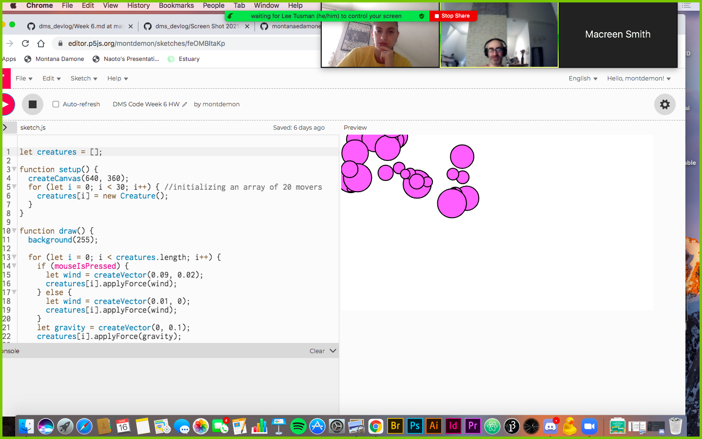

## Monty Damone - Week 6 DMS Code

This program demonstrates a very basic form of emergence. Very basic. I wanted to focus really on the code and understanding it, and I added a mousepressed function so that the "creatures" (theyre really just balls). Like I said, I didnt change the shape because the code was my focus. They demonstrate emergency because they cluster together around the mouse, and also because they move randomly in reaction to wind and gravity. Ultimately, I would like to code the program to evolve the circles to grow, or to be small and then group together and grow into one giant circle, or something along those lines. I think it would considered emergent more if I did that. 

Artificial Life/Emergence:
[Neuroevolution in Squids](https://jobtalle.com/neuroevolution_in_squids.html) is an Artifical Life program  in which the user is given a set of adjustable parameters (like tentacle length, head size, etc...) before entering the actualy game. Throughtout the game, the squids eat tiny food pellets which determine their score. From this, the squids evolve and prove how efficiently they are able to swim through the environment. There are also more advanced properties in the game, such as exploring different neural networks. To me, emergence means setting basic rules that allow the subject of the program to randomly evolve on its own within the parameters; to be able to build up an ecosystem from the rules. This program demonstrates emergence because the user predetermines the parameters, and then the squids evolve within those parameters. 

 
